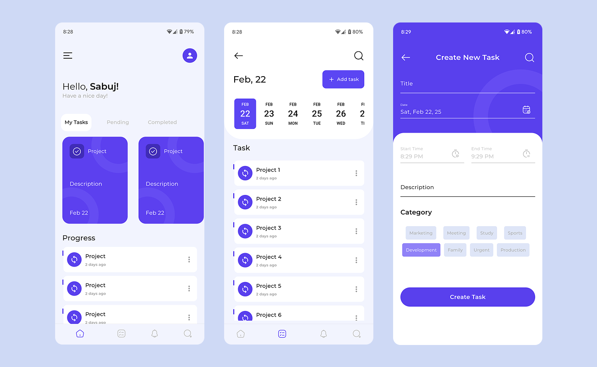

## 🚀 Figma Challenge: Task Management UI in Flutter 🎨📱

Today, I took on the challenge of designing and developing a Task Management UI in Flutter! This includes: 

✅ Home Page 
✅ Task Page 
✅ Notification Page 
✅ Search Page 
✅ Add Task Page 

The goal is to create a clean, intuitive, and efficient task management experience. From smooth UI interactions to effective state management, every detail counts! 💡 

## 🌟 Screenshots

  

 
